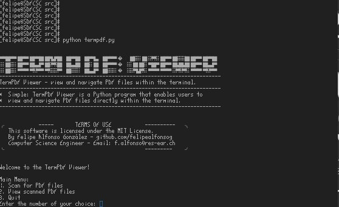
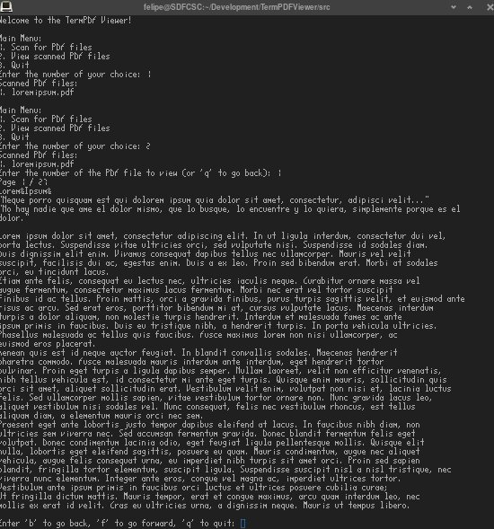

<sub>Check out the OptiCPU Project!.</sub>
#

### 📄 Terminal PDF Viewer [(Experimental Project)](#important-experimental-project)* 
##### Approaching a more stable release! Latest version is running smoothly (v.0.0.3.9 >).

TermPDF Viewer is a Python program that enables users to view and navigate PDF files directly within the terminal.

TermPDF Viewer is a command-line utility built in Python that empowers users to effortlessly view and interact with PDF files from their terminal environment. 

"TermPDF Viewer" is an open-source PDF file viewer designed to run in the terminal on Linux and macOS. It enables users to navigate and explore PDF files directly from the command line, providing an interactive and lightweight experience. Powered by the "PyMuPDF" library, this project offers high-quality rendering of PDF pages, allowing users to easily move forward and backward between pages. "TermPDF Viewer" is a versatile and practical tool for those who want to access PDF documents without the need for a heavy graphical viewer, harnessing the powerful and efficient environment of the terminal.

The program offers a menu-driven interface allowing users to scan and list PDF files in a directory, choose a file to view by entering its corresponding number, and then navigate through its pages. Additionally, the program offers convenient options to move forward, go back, or quit the PDF viewing session, ensuring a seamless and efficient document viewing experience directly within the terminal.

<sub>* This is currently an experimental phase where the primary focus is on making the system functional and establishing a practical and logical pathway that aligns with both my vision and the project's goals. It might contain errors, bugs, etc. Many other non-core elements of the project are considered secondary.</sub>


##### Important Collaboration 🚀
- A special thanks to [Soumyajit Das](https://github.com/PardesiCat) for his contributions, including testing, offering valuable ideas, and demonstrating appreciation and respect for both myself and the project.

If you're interested in becoming a collaborator, and to be in this awesome list, please visit the [Collaboration](#-support-and-contributions) section.


#### How to Use:
After installation, type 'term-pdf' in the terminal and simply position the cursor within the terminal directory of your choice. TermPDF Viewer will scan for PDF files within the specified folder, granting you instant access to view and open these files seamlessly.

#### Key Features:
Effortless Installation: Get started quickly by following the simple installation process.
Seamless PDF Scanning: Place the cursor in any terminal directory to initiate automatic scanning for PDF files.
Intuitive Navigation: Easily browse and select PDF files to view within the terminal interface.
Convenient File Access: Open and navigate PDF documents without leaving the terminal environment.

#


[](https://github.com/Naereen/badges/)


[](https://lbesson.mit-license.org/)
<!--
[](http://perso.crans.org/besson/LICENSE.html)
-->

[](https://www.vim.org)
[](https://code.visualstudio.com/)


#### Screenshots

[](#)





<!-- 
**Arch Linux** 


**macOS** 


-->

#### Prerequisites:

* Python 3.x: The program is written in Python and requires a Python 3.x interpreter to run.
* PyMuPDF: A Python binding for the MuPDF library, used to handle PDF file rendering and interaction.
*   You can install it using pip: pip install PyMuPDF
*   Make sure to include the appropriate model or adapt it for your needs.

#### Futures

[](#)

* The TermPDF Viewer will start, allowing you to:
* Scan for PDF files in the current directory.
* Select a PDF file to view by entering its number.
* View the PDF with options to move back, forward, or return to the main menu.
* Quit and return to the main menu.
* To exit the TermPDF Viewer, use 'q' in the main menu.
* ***NOW - Search a term inside the PDF in the terminal!, use 's' in the main menu.***

- View PDF documents within the terminal.
- Navigate through pages using keyboard commands.
- Experimental project with limited functionality.
- Built using the MuPDF library for rendering PDF content.


#### Installation
#### Via AUR using YAY

[](https://aur.archlinux.org/packages/term-pdf)

<!-- 
[](https://aur.archlinux.org/packages/term-pdf)
-->

<!-- 
https://aur.archlinux.org/packages/term-pdf
-->

Term PDF Viewer is available on AUR (Arch User Repository), and it can be installed using the `yay` package manager. Follow the steps below to install Term Notes:

1. Make sure you have `yay` installed. If not, you can install it with the following command:
   
   ```
   sudo pacman -S yay
   ```
   Once yay is installed, you can install Term PDF by running the following command:
   
   ```
   yay -S term-pdf
   ```
This command will automatically fetch the package from AUR and handle the installation process for you.

#### Install using a BASH script! 

[](#)


To install TermPDF, simply run the installer script available [here](https://github.com/felipealfonsog/TermPDFViewer/raw/main/installer.sh).

Or just Copy - Paste in your terminal and use -curl- to start downloading the installer:

   ```
   curl -O https://raw.githubusercontent.com/felipealfonsog/TermPDFViewer/main/installer.sh
   ```

If you want to use -wget- just copy/paste this line:

   ```
   wget https://github.com/felipealfonsog/TermPDFViewer/raw/main/installer.sh
   ```

   On macOS to download - wget - just install it with Homebrew:

   ```
   brew install wget
   ```

#### Important note when installing:

If you encounter issues executing the file in the terminal, like this message "-bash: ./installer.sh: Permission denied", follow these simple steps to fix it:

1. Open your terminal.
2. Navigate to the directory where the installer script is located using the `cd` command.
3. Run the following command to grant execute permission to the installer script:

   ```
   chmod +x installer.sh
   ```
   
4. Now you can run the installer without any problems.

   ```
   ./installer.sh
   ```
   NOTE: The script will ask for -sudo permissions-. Just simply type in macOS your macOS user password, and in Linux your -sudo- password.

Now type 'term-pdf' in the terminal and enjoy using Term-PDF! 😊🚀

Feel free to reach out if you need any further assistance!

#### Updating with the script: 
If you want to update term-notes in your system, re-run the script:

   ```
   ./installer.sh
   ```
Please note that if you encounter any issues or have suggestions, feel free to raise an issue on the [TermPDF repository](https://github.com/felipealfonsog/TermPDFViewer/issues). Your feedback is invaluable!

Thank you for joining me on this journey, and I hope Term-PDF Viewer brings value to your life and workflow. Let's continue making technology accessible and enjoyable for everyone!


#### 📝Important (Experimental Project)

[](#)

This is an experimental project aimed at bringing a PDF viewer or reader to the terminal environment. The Terminal PDF Viewer leverages the capabilities of the MuPDF library to enable users to view PDF documents directly within the terminal.

<p>This project is still in its experimental stage and may have limitations in terms of features and compatibility. Use at your own discretion.</p>

#### 🤝 Support and Contributions

If you find this project helpful and would like to support its development, there are several ways you can contribute:

- **Code Contributions**: If you're a developer, you can contribute by submitting pull requests with bug fixes, new features, or improvements. Feel free to fork the project and create your own branch to work on.
- **Bug Reports and Feedback**: If you encounter any issues or have suggestions for improvement, please open an issue on the project's GitHub repository. Your feedback is valuable in making the project better.
- **Documentation**: Improving the documentation is always appreciated. If you find any gaps or have suggestions to enhance the project's documentation, please let me know.

[](https://www.buymeacoffee.com/felipealfonsog)
[](https://www.paypal.me/felipealfonsog)
[](https://github.com/sponsors/felipealfonsog)

Your support and contributions are greatly appreciated! Thank you for your help in making this project better. If you need to mail me, this is the way: f.alfonso@res-ear.ch (I'm Felipe, the Computer Science Engineer behind this idea. Cheers!)

#### 📄 License

This project is licensed under the [MIT License](LICENSE).
